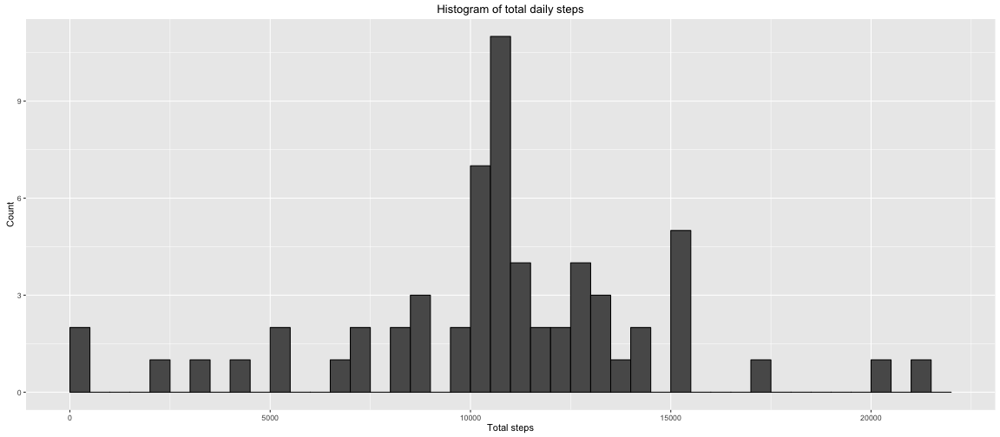

## Loading and preprocessing the data

First we will load and look at our data:


```r
data <- read.csv('activity.csv')
summary(data)
```

```
##      steps                date          interval     
##  Min.   :  0.00   2012-10-01:  288   Min.   :   0.0  
##  1st Qu.:  0.00   2012-10-02:  288   1st Qu.: 588.8  
##  Median :  0.00   2012-10-03:  288   Median :1177.5  
##  Mean   : 37.38   2012-10-04:  288   Mean   :1177.5  
##  3rd Qu.: 12.00   2012-10-05:  288   3rd Qu.:1766.2  
##  Max.   :806.00   2012-10-06:  288   Max.   :2355.0  
##  NA's   :2304     (Other)   :15840
```

```r
head(data)
```

```
##   steps       date interval
## 1    NA 2012-10-01        0
## 2    NA 2012-10-01        5
## 3    NA 2012-10-01       10
## 4    NA 2012-10-01       15
## 5    NA 2012-10-01       20
## 6    NA 2012-10-01       25
```

Looks like our data is labelled appropriately. We may need to do some grouping of the intervals to suit our needs, and we will also need to deal with missing values (initially ignoring/removing them, and imputing later).

## Mean total number of steps taken per day

Our purpose is to look at daily step count, which means we need to sum up the all the intervals for each date into one total. We will also filter out missing data points (as per assignment instructions).


```r
library(ggplot2)
library(dplyr)

filtered_data <- data %>% filter(!is.na(steps)) %>% group_by(date)
total_steps <- summarise(filtered_data, total_steps = sum(steps))
total_steps
```

```
## # A tibble: 53 x 2
##          date total_steps
##        <fctr>       <int>
## 1  2012-10-02         126
## 2  2012-10-03       11352
## 3  2012-10-04       12116
## 4  2012-10-05       13294
## 5  2012-10-06       15420
## 6  2012-10-07       11015
## 7  2012-10-09       12811
## 8  2012-10-10        9900
## 9  2012-10-11       10304
## 10 2012-10-12       17382
## # ... with 43 more rows
```

Now we can calculate the total number of steps (ignoring missing values as outlined in the assignment description) and plot a histogram showing their distribution, followed by reporting on the mean and median:


```r
cat('Total number of steps taken: ', sum(total_steps$total_steps))
```

```
## Total number of steps taken:  570608
```

```r
ggplot(total_steps, aes(total_steps)) + geom_histogram(breaks=seq(0, 22000, by =500),
                                                       col='black') +
                                        labs(title = 'Histogram of total daily steps',
                                             x = 'Total steps',
                                             y = 'Count')
```


```r
cat('Mean: ', mean(total_steps$total_steps))
```

```
## Mean:  10766.19
```

```r
cat('Median: ', median(total_steps$total_steps))
```

```
## Median:  10765
```

Although the histogram is a little sparse, it does look like a reasonably balanced distribution. The mean and median being almost the same reinforces this observation.

## Average daily activity pattern

Now we need to group our data by 5-minute intervals so we can plot a time series of the average steps taken during each 5-minute interval.


```r
filtered_data <- data %>% filter(!is.na(steps)) %>% group_by(interval)
interval_avg <- summarise(filtered_data, avg = mean(steps))
interval_avg
```

```
## # A tibble: 288 x 2
##    interval       avg
##       <int>     <dbl>
## 1         0 1.7169811
## 2         5 0.3396226
## 3        10 0.1320755
## 4        15 0.1509434
## 5        20 0.0754717
## 6        25 2.0943396
## 7        30 0.5283019
## 8        35 0.8679245
## 9        40 0.0000000
## 10       45 1.4716981
## # ... with 278 more rows
```

```r
ggplot(interval_avg, aes(interval, avg)) + geom_line() +
                                           labs(title = 'Average steps during each 5-min interval',
                                                x = '5-min interval (start)',
                                                y = 'Average steps taken')
```


And then a quick check to see which interval corresponds with the greatest average:


```r
interval_avg[interval_avg$avg == max(interval_avg$avg), 1]
```

```
## # A tibble: 1 x 1
##   interval
##      <int>
## 1      835
```

Here we see that the 5-min interval starting at minute 835 has the greatest number of steps taken on average.

## Imputing missing values

Until now we have been ignoring missing values in our calculations, but this can introduce some unwanted bias. Now we will attempt to deal with our missing values in a better way than simply ignoring them.


```r
summary(data)
```

```
##      steps                date          interval     
##  Min.   :  0.00   2012-10-01:  288   Min.   :   0.0  
##  1st Qu.:  0.00   2012-10-02:  288   1st Qu.: 588.8  
##  Median :  0.00   2012-10-03:  288   Median :1177.5  
##  Mean   : 37.38   2012-10-04:  288   Mean   :1177.5  
##  3rd Qu.: 12.00   2012-10-05:  288   3rd Qu.:1766.2  
##  Max.   :806.00   2012-10-06:  288   Max.   :2355.0  
##  NA's   :2304     (Other)   :15840
```

Here we see there are 2304 missing values. We are going to replace these missing values with the mean of steps for the corresponding intervals.


```r
impute.mean <- function(x) replace(x, is.na(x), mean(x, na.rm = TRUE))
new_data <- data %>% group_by(interval) %>% mutate(steps = impute.mean(steps))
summary(new_data)
```

```
##      steps                date          interval     
##  Min.   :  0.00   2012-10-01:  288   Min.   :   0.0  
##  1st Qu.:  0.00   2012-10-02:  288   1st Qu.: 588.8  
##  Median :  0.00   2012-10-03:  288   Median :1177.5  
##  Mean   : 37.38   2012-10-04:  288   Mean   :1177.5  
##  3rd Qu.: 27.00   2012-10-05:  288   3rd Qu.:1766.2  
##  Max.   :806.00   2012-10-06:  288   Max.   :2355.0  
##                   (Other)   :15840
```

Now we will recreate the histogram of the total daily steps and compare the results to what we had before.


```r
new_filtered_data <- new_data %>% group_by(date)
total_steps <- summarise(new_filtered_data, total_steps = sum(steps))
cat('Total number of steps taken: ', sum(total_steps$total_steps))
```

```
## Total number of steps taken:  656737.5
```

```r
ggplot(total_steps, aes(total_steps)) + geom_histogram(breaks=seq(0, 22000, by =500),
                                                       col='black') +
                                        labs(title = 'Histogram of total daily steps',
                                             x = 'Total steps',
                                             y = 'Count')
```



```r
cat('Mean: ', mean(total_steps$total_steps))
```

```
## Mean:  10766.19
```

```r
cat('Median: ', median(total_steps$total_steps))
```

```
## Median:  10766.19
```

After imputing missing values we do see an increase in the total number of steps taken, however, we see little to no change in the histogram, mean, and median. This is most likely due to the fact that the missing value's did not make up a large portion of the data set to begin with.

## Differences in activity patterns between weekdays and weekends

First we need to create a column specifying if our data occured on a weekday or a weekend. Then we are free to plot the comparison grouped by the interval.


```r
library(lattice)

filtered_data <- new_data
filtered_data$date <- as.Date(filtered_data$date)
weekdaysvec <- c('Monday', 'Tuesday', 'Wednesday', 'Thursday', 'Friday')
filtered_data$day <- factor((weekdays(filtered_data$date) %in% weekdaysvec),
                     levels=c(FALSE, TRUE), labels=c('weekend', 'weekday'))

filtered_group <- filtered_data %>% group_by(interval, day) %>% summarise(steps = sum(steps))
xyplot(steps ~ interval|day, data=filtered_group, type='l',layout=c(1,2),
       xlab='Interval', ylab='Number of Steps')
```


From this graph it appears weekdays are more active than weekends.
